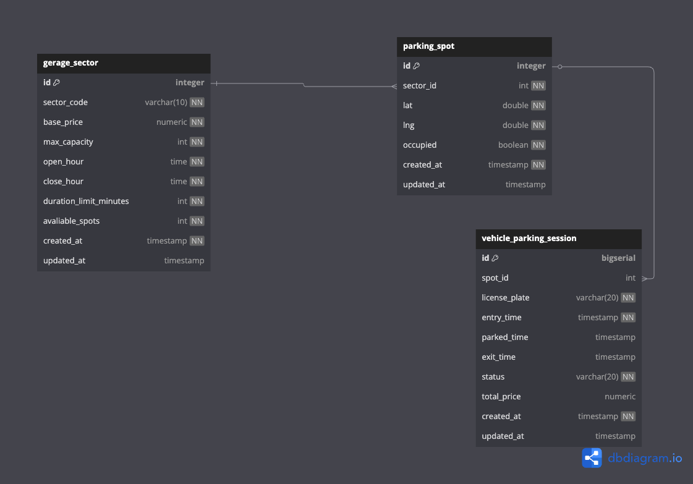

# Garage Management System
Sistema de controle de estacionamento desenvolvido para o processo seletivo da Estapar.
Este sistema gerencia setores de garagem, vagas de estacionamento e sessões de veículos, controlando entradas, saídas, estadias e faturamento de forma dinâmica.
---
## Tecnologias Utilizadas
- Kotlin
- Spring Boot 3.x
- PostgreSQL
- Spring Data JPA
- Flyway (Migrações de banco)
- Springdoc OpenAPI (Swagger 3)
- Docker (Simulador de eventos)
---
## Como Executar o Projeto
### Pré-requisitos
- Docker
- PostgreSQL
- Java 17+
- Gradle
### Passos
1. Clone o repositório:
```bash
git clone https://github.com/victorsilva95/garage-management.git
cd garage-management
```
2. Suba o docker compose:
```bash
docker-compose up -d
```
2. Builde o projeto:
```bash
./gradlew clean build
```
3. Rode o projeto:
```bash
env $(cat variables.local.env | xargs) ./gradlew bootRun
```

6. Acesse a documentação da API:
- [http://localhost:8080/swagger-ui.html](http://localhost:8080/swagger-ui.html)
---
## Principais Endpoints
| Método |        Endpoint        |                Descrição                 |
|:------:|:----------------------:|:----------------------------------------:|
|  GET   |       `/garage`        |        Cadastrar setores e vagas         |
|  POST  | `/garage/plate-status` |      Consultar status de uma placa       |
|  POST  | `/garage/spot-status`  |       Consultar status de uma vaga       |
|  GET   |   `/garage/revenue`    |  Consultar faturamento por setor e data  |
|  POST  |    `/garage/entry`     |    Cadastrar a entrada de um veículo     |
|  POST  |    `/garage/parked`    | Cadastrar o estacionamento de um veículo |
|  POST  |     `/garage/exit`     |     Cadastrar a saida de um veículo      |
---
## Modelagem de Dados
### Tabelas
#### `garage_sector`
- `id` (SERIAL, PK)
- `sector_code` (Código do setor, ex: A, B)
- `base_price` (Preço base do setor)
- `max_capacity` (Capacidade máxima)
- `open_hour` (Horário de abertura)
- `close_hour` (Horário de fechamento)
- `duration_limit_minutes` (Tempo máximo de permanência)
- `available_spots` (Quantidade de vagas livres)
- `created_at` (Data de criação do registro)
- `updated_at` (Data de atualização do registro)
#### `parking_spot`
- `id` (SERIAL, PK)
- `sector_id` (FK → `garage_sector.id`)
- `lat` (Latitude da vaga)
- `lng` (Longitude da vaga)
- `occupied` (Se a vaga está ocupada)
- `created_at` (Data de criação do registro)
- `updated_at` (Data de atualização do registro)
#### `vehicle_parking_session`
- `id` (BIGSERIAL, PK)
- `spot_id` (FK → `parking_spot.id`)
- `license_plate` (Placa do veículo)
- `entry_time` (Data/hora de entrada)
- `parked_time` (Data/hora de estacionamento)
- `exit_time` (Data/hora de saída)
- `status` (ENTERED, PARKED, EXITED)
- `total_price` (Preço final calculado)
- `created_at` (Data de criação do registro)
- `updated_at` (Data de atualização do registro)
---
## Diagrama Entidade-Relacionamento (ERD)


- Um setor (`garage_sector`) possui várias vagas (`parking_spot`).
- Uma vaga (`parking_spot`) pode ter várias sessões de veículos (`vehicle_parking_session`) ao longo do tempo.
---
## Regras de Precificação Dinâmica
- Lotação **< 25%**: **-10%** desconto sobre o preço base
- Lotação **entre 25% e 50%**: **preço normal**
- Lotação **entre 50% e 75%**: **+10%** aumento sobre o preço base
- Lotação **entre 75% e 100%**: **+25%** aumento sobre o preço base
> A precificação é recalculada dinamicamente conforme a ocupação do setor.
---
## Observações
- Eventos de entrada (`ENTRY`), estacionamento (`PARKED`) e saída (`EXIT`) atualizam a ocupação das vagas.
- O faturamento é baseado nas sessões concluídas (`EXITED`) dos veículos.
- O `/place-status` considera a contar o preço a partir da entrada e o `/spot-status` somente quando da vaga está ocupada
---
## Autor
- [Victor Hugo](https://github.com/victorsilva95)
